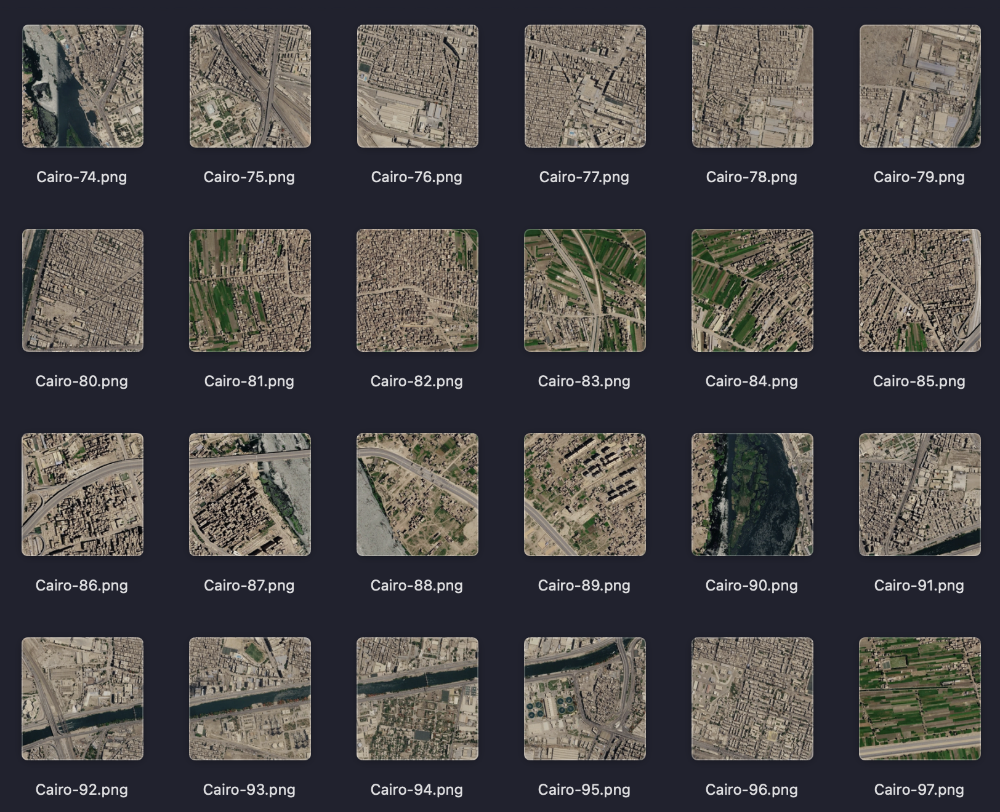

# The Falcon 360° Cairo Google Earth Dataset

## Dataset Summary

The Falcon 360° Cairo Google Earth Dataset is an AI-ready satellite imagery dataset created for computer vision and deep learning applications.

The dataset contains RGB satellite image patches generated from Google Earth Level-2A imagery covering Cairo.

## Dataset Download

The complete dataset is available from Zenodo:

https://doi.org/10.5281/zenodo.21270614

Direct download:

https://zenodo.org/records/21270614/files/sentinel2_Cairo_research_dataset%202.zip?download=1

## Creator

Author:

Walaa Ali H. Jumiawi

Organization:

The Falcon 360°

Website:

https://thefalcon360.com

ORCID:

https://orcid.org/0000-0002-5348-7970

---

## Dataset Details

Country:

Cairo

Satellite:

Google Earth MSI

Product:

Level-2A

Bands:

- B04 Red
- B03 Green
- B02 Blue

Resolution:

10 meters/pixel

Image Size:

512 × 512 pixels

Format:

PNG and GeoTIFF

---

## Intended Use

Recommended applications:

- Semantic segmentation
- Image classification
- Object detection
- Remote sensing AI
- Deep learning benchmarking

---

## Dataset Creation

The dataset was created through:

- Geographic area selection
- Google Earth retrieval
- Cloud filtering
- RGB extraction
- Quality control
- Normalization
- Dataset packaging

---

## Data Source

Google Earth Scan.

---

## Citation

Walaa Ali H. Jumiawi (2026).

The Falcon 360° Cairo Google Earth Dataset.

Zenodo.

DOI:

